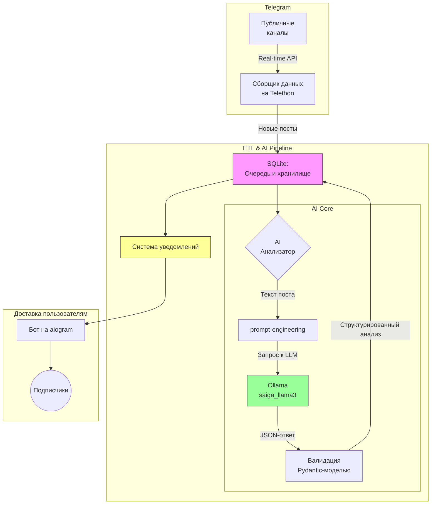

# Telegram News Analyzer & Summarizer

[](https://www.python.org/)
[](https://www.docker.com/)

**AI-ассистент, который превращает информационный хаос Telegram-каналов в структурированные и осмысленные инсайты.**

Он в реальном времени отслеживает новостные ленты, автоматически генерирует краткие саммари, определяет эмоциональную окраску и присваивает теги для удобной категоризации. Результат мгновенно доставляется подписчикам.

---

## 🚀 Ключевые возможности

*   **Real-time мониторинг:** Непрерывное отслеживание неограниченного числа публичных Telegram-каналов.
*   **AI-powered Summarization:** Генерация кратких и содержательных пересказов новостных постов с помощью LLM.
*   **Sentiment Analysis:** Автоматическое определение тональности новостей (позитивная, негативная, нейтральная).
*   **Автоматическая категоризация:** Присвоение постам релевантных хештегов из заранее определенных категорий (политика, экономика, спорт и т.д.).
*   **Структурированный вывод:** Использование Pydantic для валидации данных от LLM, что гарантирует стабильность и предсказуемость формата.
*   **Интерактивный бот:** Пользователи могут не только подписываться на сводки, но и напрямую взаимодействовать с LLM через чат.
*   **Гибкие настройки уведомлений:** Фильтрация по тональности (все/позитивные/негативные/нейтральные).
*   **Мониторинг системы:** Встроенная система health-check и статистика работы.
*   **Готовность к развертыванию:** Проект полностью контейнеризирован с помощью Docker и Docker Compose для легкого запуска одной командой.

---

## 🛠️ Стек технологий

| Категория | Технологии |
|---|---|
| **AI & NLP** | LangChain, Ollama, Pydantic, Telethon (для сбора данных) |
| **Backend** | Python 3.11+, asyncio, aiogram 3 |
| **Базы данных** | SQLite |
| **Веб-поиск** | Tavily API (опционально) |
| **DevOps** | Docker, Docker Compose |

---

## 🏛️ Архитектура

Система построена на асинхронных компонентах, которые обеспечивают эффективный сбор, обработку и доставку данных.

1.  **Сборщик данных (`Telethon`)**: Мониторит целевые каналы, используя checkpoint-механизм (сохранение ID последнего сообщения), чтобы избежать дублирования.
2.  **Очередь и хранение (`SQLite`)**: Новые сообщения сохраняются в локальную базу данных, которая служит буфером и хранилищем.
3.  **AI-анализатор (`LangChain + Ollama`)**: Сердце системы. Сообщение отправляется в LLM с тщательно спроектированным промптом, который запрашивает анализ в строгом JSON-формате.
4.  **Валидация (`Pydantic`)**: Ответ от LLM парсится и валидируется с помощью Pydantic-модели, что обеспечивает надежность данных перед сохранением и отправкой.
5.  **Система уведомлений**: Мгновенная доставка анализов подписчикам с возможностью фильтрации.
6.  **Бот-интерфейс (`aiogram`)**: Результат анализа рассылается подписчикам. Бот также обрабатывает команды для взаимодействия с пользователем.



---

## 💡 Продемонстрированные навыки

Этот проект является комплексной демонстрацией следующих компетенций:

| Область | Навыки |
|---|---|
| **LLM / NLP Engineering** | • **Промпт-инжиниринг** для получения структурированного вывода (JSON).<br>• **Structured Data Extraction** с LLM и валидация с помощью **Pydantic**.<br>• **Fine-tuning задач**: Суммаризация, анализ тональности, классификация текста.<br>• Работа с фреймворками **LangChain** и локальными LLM через **Ollama**.<br>• **Система оценки качества**: Dual-mode детекция галлюцинаций, ROUGE метрики, A/B тестирование промптов. |
| **Data Engineering** | • Создание **ETL-пайплайна** для данных в реальном времени.<br>• Реализация **checkpoint-механизмов** для инкрементальной загрузки.<br>• Управление состоянием и кэширование в **SQLite**.<br>• Система очередей и batch-обработка уведомлений. |
| **Backend & Software Engineering** | • **Асинхронное программирование** (`asyncio`).<br>• Разработка ботов с помощью **aiogram 3**.<br>• Модульная и масштабируемая архитектура приложения.<br>• Конфигурирование через переменные окружения (`.env`).<br>• Комплексная система логирования и мониторинга.<br>• Обработка ошибок и graceful shutdown. |
| **DevOps** | • **Контейнеризация** приложения и его зависимостей с помощью **Docker**.<br>• Оркестрация сервисов (бот + LLM) через **Docker Compose**.<br>• Настройка `health-check` для гарантированного порядка запуска сервисов. |

---

## 🚀 Как запустить

### 1. Через Docker (рекомендуемый способ)
```bash
# Клонируйте репозиторий и создайте .env файл
git clone https://github.com/000p1umDiesel/telegram-chatbot_news_analyzer
cd ваш_репозиторий
cp .env

# Заполните .env

# Первый запуск — скачается модель Ollama, это может занять время
docker compose up --build -d

# Посмотреть логи бота
docker compose logs -f bot
```
`docker-compose.yml` поднимает два сервиса: `ollama` (LLM-сервер) и `bot` (приложение). Бот стартует только после того, как `ollama` будет готова к работе (реализовано через `health-check`).

### 2. Локально (для разработки)
```bash
# 1. Установите зависимости
python -m venv venv && source venv/bin/activate
pip install -r requirements.txt

# 2. Создайте и настройте .env файл
cp .env.example .env
# Заполните .env, особенно TELEGRAM_BOT_TOKEN и каналы

# 3. Создайте сессию Telethon (один раз)
python init_session.py

# 4. Запустите Ollama (например, через Docker)
# Убедитесь, что модель доступна
docker run -d -v ollama:/root/.ollama -p 11434:11434 --name ollama ollama/ollama
ollama pull ilyagusev/saiga_llama3

# 5. Запустите приложение
python main.py
```

---

## ⚙️ Конфигурация (`.env`)
Скопируйте `.env.example` в `.env` и заполните своими данными.

```env
# API-ключи для доступа к Telegram API
TELEGRAM_API_ID=
TELEGRAM_API_HASH=
TELEGRAM_PHONE=

# Токен вашего бота от @BotFather
TELEGRAM_BOT_TOKEN=

# Каналы для мониторинга (через запятую, без @)
# Пример: "durov,meduzalive,-1001234567890"
TELEGRAM_CHANNEL_IDS=

# URL для Ollama. Для Docker используйте http://ollama:11434. Для локального запуска http://localhost:11434
OLLAMA_BASE_URL=http://ollama:11434
# Модель для анализа
OLLAMA_MODEL=ilyagusev/saiga_llama3

# Опциональный ключ для поиска через Tavily
TAVILY_API_KEY=
```

---

## 🤖 Команды бота

### Основные команды
| Команда | Описание |
|---|---|
| `/start` | Начало работы с ботом |
| `/help` | Показать все доступные команды |
| `/subscribe` | Подписаться на получение новостных сводок |

### Взаимодействие с AI
| Команда | Описание |
|---|---|
| `/chat <текст>` | Прямой диалог с LLM-ассистентом |
| `/analyze <текст>` | Запросить анализ произвольного текста |
| `/web <запрос>` | Поиск информации в интернете (если настроен Tavily) |

### Статистика и мониторинг
| Команда | Описание |
|---|---|
| `/stats` | Показать статистику по обработанным новостям |

---

## 📊 Особенности системы уведомлений

Система уведомлений была полностью переработана для максимальной надежности:

- **Мгновенная доставка**: Уведомления отправляются сразу после анализа (batch_size = 1)
- **Фильтрация по тональности**: Пользователи могут выбрать какие новости получать
- **Простое управление**: Настройки через команды вместо callback-кнопок
- **Отказоустойчивость**: Обработка ошибок отправки и повторные попытки
- **Упрощенное форматирование**: Отключен markdown для избежания ошибок парсинга

### Формат уведомлений
```
📰 Новость из канала @channel_name

📝 Краткое содержание: [краткий пересказ новости]

🎯 Тональность: Позитивная/Негативная/Нейтральная
🏷️ Теги: #политика #экономика

🔗 Источник: [ссылка на оригинальный пост]
```

---

## 📈 Статистика и мониторинг

Система включает комплексный мониторинг:
- Количество обработанных сообщений
- Статистика по каналам
- Производительность AI-анализа
- Статус уведомлений
- Health-check всех компонентов

---

## 🧪 Система тестирования и оценки качества

Проект включает комплексную систему тестирования для оценки качества LLM-анализа и производительности системы.

### 📊 Доступные тесты

| Тест | Описание | Метрики |
|---|---|---|
| **Comprehensive** | Комплексное тестирование всех компонентов | • Dual-mode детекция галлюцинаций<br>• Консистентность sentiment analysis<br>• Качество суммаризации<br>• Релевантность хештегов |
| **ROUGE Metrics** | Оценка качества суммаризации | • ROUGE-1, ROUGE-2, ROUGE-L<br>• BLEU scores<br>• Консистентность длины |
| **Performance** | Тестирование производительности | • Скорость БД операций<br>• Пропускная способность LLM<br>• Использование ресурсов |
| **A/B Prompt** | Сравнение вариантов промптов | • 5 различных стратегий промптинга<br>• Автоматическая оценка качества<br>• Рейтинг лучших подходов |

### 🚀 Запуск тестов

#### Все тесты сразу (рекомендуется)
```bash
# Полное тестирование в параллельном режиме
python evaluation/run_all_tests.py --tests all --parallel

# Быстрое тестирование с уменьшенными выборками
python evaluation/run_all_tests.py --tests all --quick --parallel
```

#### Отдельные тесты
```bash
# Комплексное тестирование (включает улучшенную детекцию галлюцинаций)
python evaluation/comprehensive_test.py --samples 50 --save-report

# ROUGE метрики для суммаризации
python evaluation/rouge_metrics_test.py --samples 100

# Тестирование производительности
python evaluation/performance_test.py --samples 20

# A/B тестирование промптов
python evaluation/ab_prompt_test.py --sample-size 15

# Демо-режим (с синтетическими данными)
python evaluation/demo_tests.py
```

### 🔍 Особенности детекции галлюцинаций

Система использует **dual-mode подход** для максимальной точности:

1. **Sentence-level анализ**: Проверка каждого предложения саммари отдельно
2. **Full-text анализ**: Проверка всего саммари как единого текста

**NLI модель**: `cointegrated/rubert-base-cased-nli-threeway` для русскоязычных текстов

**Пороги детекции**: 0.3, 0.5, 0.7 (чем ниже entailment score, тем выше вероятность галлюцинации)

### 📈 Интерпретация результатов

#### Показатели качества
- **ROUGE-1 F1 > 0.3**: Хорошее качество суммаризации
- **Entailment Score > 0.5**: Низкий риск галлюцинаций
- **Sentiment Consistency > 80%**: Стабильный анализ тональности
- **LLM Throughput > 10 анализов/мин**: Приемлемая производительность

#### Примеры результатов
```
📊 РЕЗУЛЬТАТЫ COMPREHENSIVE ТЕСТА:
✅ Тестов пройдено: 5/5 (100%)
⏱️ Время выполнения: 12.2с

📝 SENTENCE-LEVEL анализ галлюцинаций:
🎯 Средний entailment score: 0.577
🚨 Галлюцинации (порог 0.5): 33.3%

📄 FULL-TEXT анализ галлюцинаций:
🎯 Средний entailment score: 0.577
🚨 Галлюцинации (порог 0.5): 33.3%

📋 Найдено 7 примеров галлюцинаций для анализа
```

### 📁 Результаты тестов

Все результаты сохраняются в папке `evaluation/`:
- `*_results.json` - детальные результаты каждого теста
- `test_report.json/txt` - комплексный отчет
- `test_suite_report.json` - итоговый отчет всех тестов

**Примечание**: Файлы результатов добавлены в `.gitignore` и не попадают в репозиторий.

---

## ❓ F.A.Q. (Часто задаваемые вопросы)

**В: `docker compose up` выполняется очень долго или показывает ошибку `unhealthy`. Что делать?**  
**О:** Это нормально при первом запуске. Сервис бота не стартует, пока сервис `ollama` не скачает LLM-модель (`~8 ГБ`). Health check дает на это 5 минут (`start_period: 5m` в `docker-compose.yml`). Просто подождите, возможно потребуется повторно пересобрать билд после скаченной модели. Если через 10-15 минут проблема сохраняется, проверьте логи `docker compose logs ollama_service`, возможно, есть проблема с сетью.

**В: Сколько оперативной памяти нужно для работы?**  
**О:** Модель `saiga_llama3` в формате `q4_0` потребляет около 5 ГБ VRAM/RAM. Для комфортной работы всей системы рекомендуется иметь **минимум 8 ГБ, а лучше 16 ГБ** свободной оперативной памяти.

**В: Как использовать другую LLM-модель?**  
**О:** 1. Измените `OLLAMA_MODEL` в файле `.env`. 2. Измените имя модели в `healthcheck` секции для `ollama` в `docker-compose.yml`. 3. Запустите `docker compose up --build`. Система автоматически скачает новую модель при первом запуске.

**В: Я запустил бота, но он молчит и не присылает новости. В чем дело?**  
**О:** Проверьте несколько вещей:
1.  **Подписка**: Убедитесь, что вы подписались через `/subscribe`
2.  **Настройки**: Проверьте настройки уведомлений через `/notifications`
3.  **Каналы в `.env`**: Убедитесь, что `TELEGRAM_CHANNEL_IDS` указаны правильно, без `@` и разделены запятыми
4.  **Логи бота**: Посмотрите `docker compose logs -f bot`. Возможно, там есть ошибки
5.  **Активность в каналах**: Убедитесь, что в отслеживаемых каналах были новые посты *после* запуска бота

**В: Где взять `TELEGRAM_API_ID` и `TELEGRAM_API_HASH`?**  
**О:** Их можно получить на официальном сайте Telegram:
1.  Перейдите на [my.telegram.org](https://my.telegram.org) и войдите в свой аккаунт.
2.  Выберите раздел "API development tools".
3.  Заполните форму (название и короткое имя могут быть любыми).
4.  Вы получите `api_id` и `api_hash` на этой же странице.

**В: Как проверить, что система работает правильно?**  
**О:** Используйте команды для диагностики:
- `/stats` - статистика обработанных сообщений
- `/system` - техническая информация о системе
- `/notifications` - текущие настройки уведомлений
- Проверьте логи: `docker compose logs -f bot`

---

SIMPLY LOVELY ❤️

