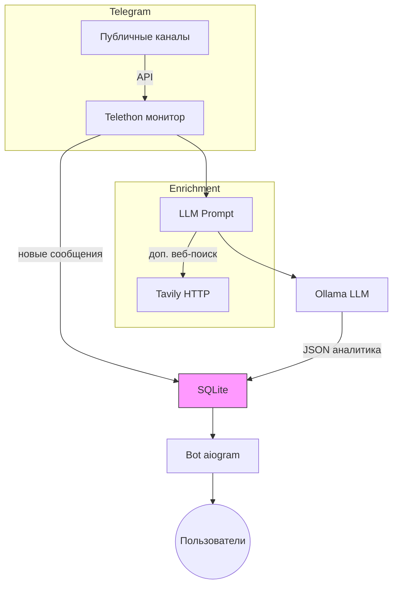

# Telegram News Analyzer 

Бот читает выбранные Telegram-каналы, коротко пересказывает новости, расставляет хештеги и оценивает тональность (позитив/негатив/нейтрально) и присылает результат подписчикам.

⚙️ Что под капотом 
------------------------------------------------
* **aiogram 3** — принимаем команды от пользователей
* **Telethon 1.36** — умеем читать публичные каналы напрямую
* **LangChain + Ollama** — просим LLM-модель сделать сводку
* **SQLite** — хранится только то, что нужно (последний ID, подписчики, кэш анализа)
* Всё это крутится в одном `docker compose` вместе с контейнером Ollama.

## Архитектура



### Что происходит
1. **Telethon** каждую минуту проверяет каналы, запоминает последний ID, чтобы не дёргать старое.
2. Свежий пост кладётся в SQLite и одновременно уходит в **LangChain**.
3. Перед вызовом LLM добавляется короткий веб-поиск (если нужно) — улучшает факты.
4. **Ollama** генерирует JSON: summary, sentiment, hashtags.
5. Результат ложится в БД и тут же рассылается ботом тем, кто нажал «Подписаться».

## Как запустить у себя

### 1. Через Docker (проще всего)
```bash
# первый запуск — модель скачается, поэтому ждать чуть дольше
docker compose up --build -d

# посмотреть логи бота
docker compose logs -f bot
```
Что происходит: `docker-compose.yml` поднимает два сервиса —
`ollama` (LLM-сервер) и `bot`.  Бот стартует **только когда** сервис
Ollama ответил «готов» (health-check).  Если модели ещё нет, Ollama сам
скачает её в том `ollama_data` — повторные запуски идут без задержек.

### 2. Локально, без контейнеров
```bash
# ➊ Python 3.11+ и зависимости
python -m venv venv && source venv/bin/activate
pip install -r requirements.txt

# ➋ Настройки
cp .env.example .env   # пропишите токен бота и каналы

# ➌ Откройте сессию Telethon (один раз)
python init_session.py       # введёте номер телефона и код

# ➍ Запустите Ollama
ollama serve &               # или `docker run -p 11434:11434 ollama/ollama`

# ➎ Старт бота
python main.py
```
Первый запрос к LLM может занять время — библиотека `ollama` проверит,
есть ли модель `ilyagusev/saiga_llama3`, и скачает (~3 ГБ), если её
нет.  Дальше всё летает.

## Переменные окружения (`.env`)
```env
# ==========================================================
# .env — пример конфигурации (заполните перед запуском)
# ==========================================================

# ----------------------------------------------------------
# Telegram (Telethon)
# ----------------------------------------------------------
TELEGRAM_API_ID=
TELEGRAM_API_HASH=
# номер телефона в формате +79991234567 (нужен один раз для init_session)
TELEGRAM_PHONE=

# ----------------------------------------------------------
# Telegram Bot
# ----------------------------------------------------------
TELEGRAM_BOT_TOKEN=

# ----------------------------------------------------------
# Мониторинг каналов
# ----------------------------------------------------------
# Пример: "ria_novosti,meduzalive,-1001234567890"
TELEGRAM_CHANNEL_IDS=

# ----------------------------------------------------------
# Интервалы (сек.)
# ----------------------------------------------------------
CHECK_INTERVAL=60          # частота опроса каналов
ERROR_RETRY_INTERVAL=300   # пауза после ошибки

# ----------------------------------------------------------
# LLM / Ollama
# ----------------------------------------------------------
# ЛОКАЛЬНЫЙ запуск  → http://localhost:11434
# docker-compose    → http://ollama:11434
OLLAMA_BASE_URL=http://ollama:11434
OLLAMA_MODEL=ilyagusev/saiga_llama3

# ----------------------------------------------------------
# Tavily Search (опционально)
# ----------------------------------------------------------
TAVILY_API_KEY=

# ----------------------------------------------------------
# SQLite база
# ----------------------------------------------------------
DATABASE_URL=data/storage.db
```
Если запускаете не через Docker, убедитесь, что у вас стоит в  `OLLAMA_BASE_URL`

## Команды бота 

| Команда | Описание |
|---------|----------|
| /start  | Первое знакомство, кнопка «Подписаться» |
| /stats  | Статистика: сколько новостей, доля позитива/негатива, топ-хештеги |
| /chat `<текст>` | Короткий диалог с LLM |
| /web `<запрос>` | Поиск информации в интернете |
| /analyze `<текст>` | Анализ произвольного текста |


## Возможные вопросы

**Q:** «Бот молчит после /start?»  
**A:** Проверьте, что в `.env` указаны реальные каналы и бот не заблокирован у вас в Telegram.

**Q:** «Сколько нужно RAM?»  
**A:** Saiga-llama3 занимает ~5 ГБ + 1-2 ГБ для инференса. На 14 ГБ Mac всё работает комфортно.

**Q:** «Можно сменить модель?»  
**A:** Да — задайте `OLLAMA_MODEL` и в docker-compose.yml и выполните `ollama pull <model>` (или позвольте боту скачать её при первом запросе).

+---

+SIMPLY LOVELY ❤️
