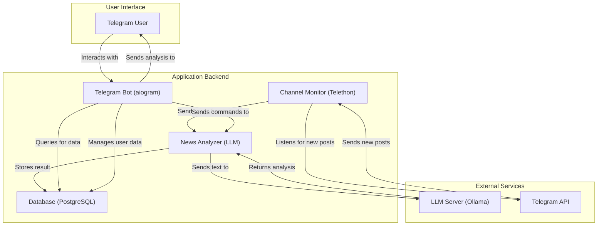

# Telegram-бот для Интеллектуального Анализа Новостей

---

Это комплексный пет-проект, демонстрирующий полный цикл разработки и внедрения NLP-решения: от сбора данных и файн-тюнинга языковой модели (LLM) до создания асинхронного Telegram-бота и его развертывания в Docker-контейнерах.

## Проблема и Решение

**Проблема:** Информационный шум в Telegram-каналах. Ежедневно пользователи сталкиваются с огромным потоком новостей, который сложно фильтровать и анализировать вручную. Отсутствие структурированной информации, такой как тематика, тональность и ключевые тезисы, затрудняет быстрое восприятие контента.

**Решение:** Telegram-бот, который выступает в роли персонального новостного ассистента. Он:
1.  **Мониторит** указанные пользователем Telegram-каналы в реальном времени.
2.  **Анализирует** каждую новость с помощью кастомизированной языковой модели (LLM).
3.  **Структурирует** информацию: выделяет краткое содержание, определяет тональность (позитивная, негативная, нейтральная) и генерирует релевантные хештеги.
4.  **Отправляет** пользователям уведомления с уже обработанной информацией, позволяя быстро понять суть новости.
5.  **Предоставляет** интерактивные функции: чат с ИИ, поиск по новостям и получение статистики.

## Ключевые Возможности

-   **Автоматический мониторинг** неограниченного числа публичных Telegram-каналов.
-   **Глубокий анализ текста** с использованием LLM для:
    -   Суммаризации (краткое содержание).
    -   Определения тональности (Sentiment Analysis).
    -   Генерации тематических хештегов.
-   **Файн-тюнинг LLM:** Модель была дообучена на специализированном датасете для повышения качества анализа новостного контента (детали в ноутбуке `notebooks/llm-finetuning.ipynb`).
-   **Система оценки качества:** Разработан комплекс тестов для оценки работы модели, включая семантическую близость, проверку на галлюцинации и ROUGE-метрики (`evaluation/`).
-   **Асинхронная архитектура:** Построен на `asyncio`, `aiogram` и `Telethon` для высокой производительности и масштабируемости.
-   **Интерактивный бот:** Поддерживает диалоговый режим, поиск по новостям, кастомизацию подписок и получение статистики.
-   **Надежность и отказоустойчивость:** Реализованы механизмы `retry` с `exponential backoff` для сетевых запросов и `health checks` для сервисов.
-   **Простое развертывание:** Проект полностью контейнеризирован с помощью `Docker` и `Docker Compose` для быстрого запуска.

## Архитектура Системы

Система состоит из нескольких взаимодействующих сервисов, что обеспечивает модульность и масштабируемость.



##  Технологический Стек

-   **Backend:** Python 3.11+, asyncio
-   **Telegram Bot:** `aiogram 3`
-   **Telegram Client (мониторинг):** `Telethon`
-   **LLM:**
    -   **Модель:** `Double00/saiga_llama3:latest` (или ваша кастомная)
    -   **Сервер:** `Ollama`
    -   **Взаимодействие:** `langchain`
-   **База данных:** PostgreSQL
-   **ORM/Адаптер БД:** `asyncpg`
-   **Контейнеризация:** Docker, Docker Compose
-   **Инструменты разработки:**
    -   **Ноутбуки:** Jupyter Lab (`notebooks/`)
    -   **Линтинг и форматирование:** `ruff`

## LLM-компонент: Промпт-инжиниринг и Файн-тюнинг

Качество анализа напрямую зависит от работы с языковой моделью.

### Кастомная дообученная модель

Этот проект использует дообученную (fine-tuned) версию модели Llama 3, специально адаптированную для анализа русскоязычных новостей. Модель была обучена на кастомном датасете для улучшения качества суммаризации, определения тональности и генерации релевантных хештегов.

**Вы можете найти и скачать модель здесь:**
-   **Ollama Hub:** [Double00/saiga_llama3](https://ollama.com/Double00/saiga_llama3)
-   **Hugging Face:** [Double00/saiga_llama3](https://huggingface.co/Palatov/saiga-llama3-8b-hashtag_news-4bit)

Чтобы использовать её с Ollama, выполните команду:
```bash
ollama ollama run Double00/saiga_llama3
```

### Промпт-инжиниринг

Для получения структурированного JSON-ответа от модели был разработан специальный промпт с использованием техники **few-shot learning**. Промпт включает:
-   Четкую инструкцию (роль модели).
-   Примеры (вопрос-ответ) для демонстрации желаемого формата.
-   Динамические параметры, такие как категории хештегов и максимальная длина резюме.

*Подробнее в методе `_get_optimized_prompt` в `services/llm/analyzer.py`.*

### Файн-тюнинг

Для улучшения качества анализа новостей базовая модель `llama3` была дообучена (**fine-tuned**) на собранном и очищенном датасете новостных статей. Это позволило:
-   Адаптировать модель к стилистике и лексике новостных текстов.
-   Повысить точность определения тональности и релевантность генерируемых хештегов.

*Весь процесс файн-тюнинга, включая подготовку данных и обучение, задокументирован в ноутбуке `notebooks/llm-finetuning.ipynb`.*

## Система Оценки Качества (Evaluation)

Для объективной оценки качества работы LLM была создана система тестов в директории `evaluation/`.

| Тест                 | Цель                                                                                              | Метрики/Методы                                    |
| -------------------- | ------------------------------------------------------------------------------------------------- | ------------------------------------------------- |
| **Hallucination Test** | Проверка, не придумывает ли модель факты, которых не было в исходном тексте.                        | Сравнение сгенерированного резюме с оригиналом    |
| **Semantic Test**    | Оценка семантической близости резюме к исходной новости.                                          | Косинусное сходство на эмбеддингах (Sentence Transformers) |
| **ROUGE Test**       | Измерение качества резюме путем сравнения n-грамм с эталонным текстом.                             | ROUGE-1, ROUGE-2, ROUGE-L                         |
| **Sentiment Test**   | Оценка точности определения тональности на размеченном датасете.                                  | Accuracy, Precision, Recall, F1-score             |
| **Hashtag Test**     | Проверка релевантности и соответствия хештегов заданным категориям.                               | Ручная оценка, % соответствия категориям          |

*Скрипты для запуска тестов находятся в `evaluation/tests/`.*

## Установка и Запуск

### Предварительные требования
-   Docker и Docker Compose
-   Python 3.11+
-   Данные для входа в Telegram-аккаунт (для мониторинга)

### Шаги для запуска
1.  **Клонируйте репозиторий:**
    ```bash
    git clone https://github.com/your_username/telegram-chatbot_news_analyzer.git
    cd telegram-chatbot_news_analyzer
    ```
2.  **Настройте окружение:**
    Создайте файл `.env` и заполните его своими данными.
    Вам понадобятся:
    - `TELEGRAM_API_ID` и `TELEGRAM_API_HASH` с my.telegram.org
    - `TELEGRAM_BOT_TOKEN` от @BotFather
    - Список `TELEGRAM_CHANNEL_IDS` для мониторинга
    - `TELEGRAM_PHONE`
    - `OLLAMA_BASE_URL`
    - `OLLAMA_MODEL`
    - `TAVILY_API_KEY`
    - `POSTGRES_DB`
    - `POSTGRES_USER`
    - `POSTGRES_PASSWORD`
    - `DB_ENGINE`
    - `POSTGRES_DSN`
    **Важно:** Убедитесь, что в файле `.env` в качестве `OLLAMA_MODEL` указана кастомная модель:
    ```
    OLLAMA_MODEL=Double00/saiga_llama3:latest
    ```

3.  **Инициализируйте сессию Telethon:**
    Этот шаг необходим для входа в ваш Telegram-аккаунт.
    ```bash
    python init_session.py
    ```
4.  **Запустите проект с помощью Docker Compose:**
    ```bash
    docker-compose up -d --build
    ```
    Эта команда соберет образы и запустит все сервисы (бот, базу данных, Ollama).

5.  **Просмотр логов:**
    ```bash
    docker-compose logs -f bot
    ```

##  Команды Бота
- `/start` - приветствие и основное меню.
- `/subscribe` - управление подпиской на уведомления.
- `/stats` - статистика по проанализированным новостям.
- `/chat <текст>` - прямой диалог с LLM.
- `/analyze <текст>` - анализ произвольного текста.
- `/digest` - получение дайджеста новостей за день.

##  Дальнейшие Шаги

-   **Расширение системы оценки:** Добавить больше тестов, включая измерение скорости (performance) и устойчивости к атакам (adversarial attacks).
-   **Веб-интерфейс:** Создать дашборд для визуализации статистики и управления каналами.
-   **Поддержка большего числа моделей:** Реализовать возможность выбора LLM через API (например, модели от OpenAI, Anthropic).
-   **Персонализация:** Внедрить векторный поиск по новостям и рекомендовать контент на основе предпочтений пользователя.
-   **CI/CD:** Настроить автоматическое тестирование и развертывание с помощью GitHub Actions.

